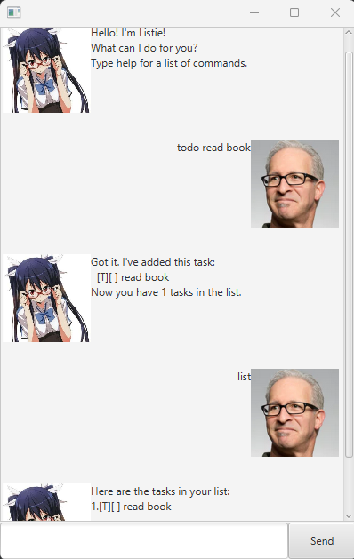

# Listie User Guide



Ever wanted a to-do list in the form of a chatbot?

Maybe even one that lets you track items in the form of deadline and events?

Listie is here to solve your oddly specific problem!

## Adding deadlines

If you wanted to add a deadline, you can do so by specifying the description and due date.

Example: `deadline return book /by 2019-10-15`


```
Got it. I've added this task:
 [D][] return book (by: OCTOBER 15 2019)    
Now you have 1 tasks in the list.
```
Notice how D denotes the type of task, deadline. T is for todo and E is for event.
The [] that comes after shows that the task is not marked. [X] shows that it is marked.

## Update

You are also able to update items directly instead of deleting and adding them again.


## Local Storage

It wouldn't make sense if you had to add all your items again every time you closed the app.

Listie tracks your changes after you say 'bye', letting you can pick up where you left off.

## Exhaustive list of commands

Before you start, remember to create an empty folder and put Listie inside!

You could ask Listie directly, but here are sample commands that work for ease of access:
Do note that formatting must be followed as below and commands are case-sensitive.
Dates for example are in the format yyyy-mm-dd.

- todo read book: adds a todo item with description 'read book'
- deadline return book /by 2025-10-15: adds a deadline item with description 'return book' and due date on 15 Oct 2025
- event project meeting /from 2025-10-15 /to 2025-10-16: adds a event item with description 'project meeting' and start date 15 Oct 2025 and end date 16 Oct 2025
- list: returns a list of your items so far
- mark 1: marks the first item in your list (we start counting from 1)
- unmark 2: unmarks the second item in your list
- delete 5: deletes the fifth item in your list
- find book: returns a list of items with descriptions that contain 'book' in them
- bye: exits the chatbot


- updateDesc 1 write summary: changes the description of the first item in your list to 'write summary'
- updateBy 1 2025-10-14: changes the due date of the first item (that is assumed to be a deadline item) to 14 Oct 2025
- updateFrom 1 2025-10-14: changes the start date of the first item (that is assumed to be a event item) to 14 Oct 2025
- updateTo 1 2025-10-14: changes the end date of the first item (that is assumed to be a event item) to 14 Oct 2025